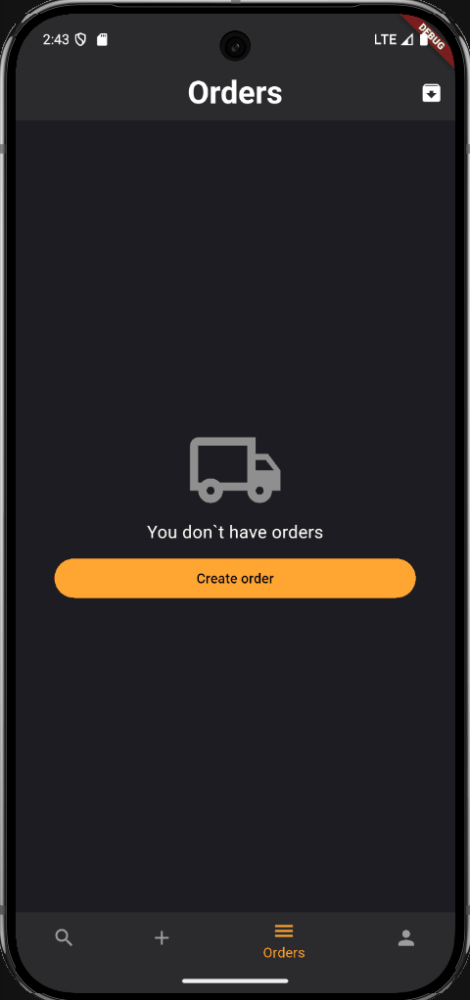
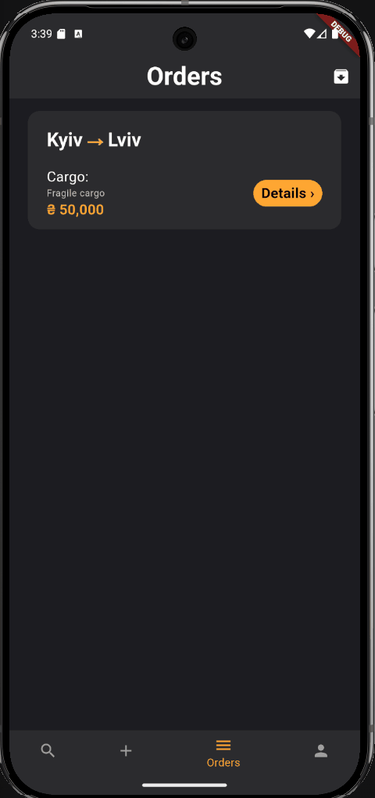
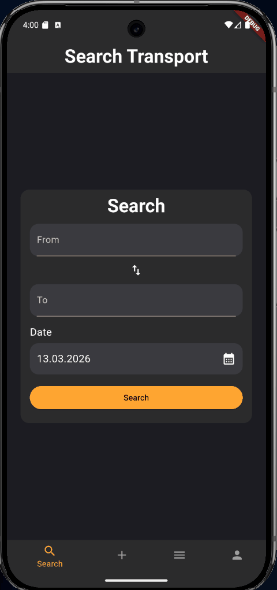

# 🚛 TransitTracer

<p align="center">
  
  
  
  
</p>

**TransitTracer** is a robust logistics platform built with Flutter, designed to connect clients with cargo drivers. It provides a seamless experience for creating, managing, and tracking transport orders across the EU, Italy, and Ukraine.

---

## ✨ Key Features

* 🌍 **Multi-language Support:** Native localization for **English, Ukrainian, and Italian** using `intl`.
* 📶 **Smart Offline Mode:** Utilizes Firebase Persistence and `internet_connection_checker_plus` to handle unstable connections gracefully with specialized UI banners.
* 📍 **Advanced Location Services:** Integrated city search and autocomplete features for precise logistics routing.
* 👤 **Profile Management:** Full user profile customization, including image uploading and cropping (`image_picker` & `image_cropper`).
* 🌓 **Modern UI/UX:** Responsive design using `auto_size_text` and `cached_network_image` for a polished look.

---

## 🏗 Architecture & Engineering

The project follows a **Feature-First Clean Architecture** approach, ensuring the codebase is scalable, testable, and maintainable.

### Technical Excellence:
* **State Management:** Powered by **BLoC/Cubit** for clear separation of business logic and UI.
* **Dependency Injection:** Managed via **GetIt** for efficient service decoupling.
* **Type-Safe Routing:** Implementation of **AutoRoute** for declarative and compile-time safe navigation.
* **Enum-Based Validation:** A custom, scalable validation engine for forms (Auth, Orders) that supports localized error handling.
* **Network Layer:** Robust API communication handled by **Dio** with centralized error interceptors.

---

## 🛠 Tech Stack

| Category | Technology |
| :--- | :--- |
| **Framework** | Flutter |
| **State Management** | BLoC / Cubit / Equatable |
| **Backend** | Firebase (Auth, Firestore, Storage) |
| **Navigation** | AutoRoute |
| **Local Storage** | Shared Preferences |
| **DI** | GetIt |
| **Networking** | Dio |

---

## 📂 Project Structure

```text
lib/
 ├── app/             # App entry, DI setup (GetIt), and AutoRouter
 ├── core/            # Global shared resources
 │    ├── data/       # Global Repositories & Models
 │    ├── services/   # Network, Env, Geo, and AppInfo services
 │    ├── error_handlers/ # Specialized Firebase & Geo error logic
 │    ├── validators/ # Enum-based type-safe validation system
 │    └── theme/      # Custom design system & styles
 ├── features/        # Business logic modules
 │    ├── auth/       # Authentication & Authorization
 │    ├── orders/     # Complex order management (CRUD)
 │    ├── profile/    # User settings and profile data
 │    └── settings/   # Localization and theme toggling
 └── l10n/            # Localization files (.arb)
```
---

## 📱 App Showcase

<p align="center">
  Explore the core features of the application through these interactive demos.
</p>

<div align="center">

<table>
  <tr>
    <td align="center">
      🔐 <b>Authentication</b><br>
      
      <br><i>Firebase Auth & Validation</i>
    </td>
    <td width="200"></td> <!-- Отступ между GIF -->
    <td align="center">
      📦 <b>Order Creation</b><br>
      
      <br><i>Smart Form Handling</i>
    </td>
  </tr>
</table>

<br>

<table>
  <tr>
    <td align="center">
      🔄 <b>Lifecycle & CRUD</b><br>
      
      <br><i>Edit, Archive & Delete</i>
    </td>
    <td width="200"></td> <!-- Отступ между GIF -->
    <td align="center">
      👤 <b>Profile & System</b><br>
      
      <br><i>User Settings & Logout</i>
    </td>
  </tr>
</table>

</div>

